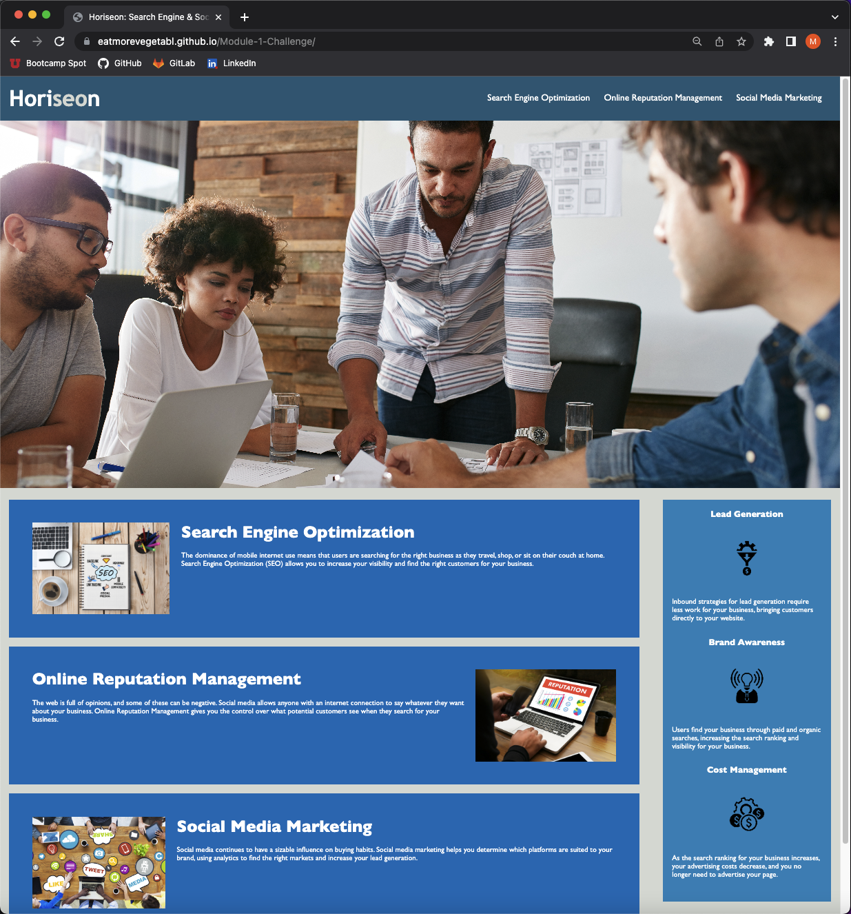

# Updating Horiseon Website - Module 1 Challenge

## Description

The purpose of this project was to update the Horiseon website in order to increase its web accesibility, thus people with disabilities will be able to access this website as well. We also updated this website to use semantic HTML and CSS syntax.

## Visuals

## Link

Below is the link to access the completed webpage:

(https://eatmorevegetabl.github.io/Module-1-Challenge/)